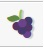
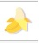
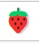
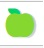
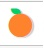
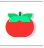
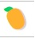
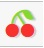

# Match 2 Fruit Game

Match 2 Fruit is a memory game where you match two fruits. You flip the first card and try to find its match by choosing a second card. Once you match two fruits, continue to flip each card and match fruit types until the board is complete. The score has two elements, time and moves.

## Features of Website

## Header

* The website has a fixed header with the Match 2 Logo aligned left and it is responsive on all device sizes.
* This will be displayed throughout the website.

## NavBar

* The navigation links to the Home and the Feedback page and it is responsive on all device sizes.
* Users will be able to navigate between each page of the site, having consistent menu placement on the different screen sizes.

## Footer

* The website has a fixed footer which describes what programs the site was designed in, with a link to each that opens in a new page.
* Users will be able to find additonal information about the programs used.

## Game Board

* The Main Game Board has a Start button with the amount of moves taken so far and the time since starting this turn, both displayed above the random grid of Cards.

* The Main Game Board (game.html) is a 4x4 set of cards which can be turned with a mouse click, clicking a second card to try find the fruit match. If unsuccessful, both unmatched turned cards revert back to being unturned.

* The board is built using the *[Grid Template Columns](https://developer.mozilla.org/en-US/docs/Web/CSS/grid-template-columns)* CSS property.

* The Main Game Board has a Play Again button which links back to Index.html.

## Design Choices

## Fruit Emojis

* The following Emoji's were used to randomly fill main game board using the generateGame function:

| EMOJI       | Unicode Hex | HTML Dec Value |Image           |
|-------------|-------------|----------------|----------------|
| Grapes      | U+1F347     | &#127815       ||
| Banana      | U+1F34C     | &#127820       ||
| Strawberry  | U+1F353     | &#127827       ||
| Green Apple | U+1F34F     | &#127823       ||
| Pineapple   | U+1F34D     | &#127821       ||
| Tangerine   | U+1F34A     | &#127818       ||
| Coconut     | U+1F965     | &#129381       ||
| Tomato      | U+1F345     | &#127813       ||
| Mango       | U+1F96D     | &#129389       ||
| Cherries    | U+1F352     | &#127826       ||

## Colors

* The website, logo and text effects use the following colors which go together well.

* Forest Green Traditional, Marigold and Golden Poppy.

## Fonts

* The below fonts look well together on the page, and suit the look and feel of the website.

* Used the font *[Muli from Adobe Fonts](https://fonts.adobe.com/fonts/muli)* for the main text of the website and buttons.

* Muli is no longer listed under Google Fonts but can still be imported for use with a website, explanation found *[here](https://www.reddit.com/r/fonts/comments/i1b44r/did_google_remove_muli_font_from_its_collection/here)*.

## Logo

* The logo was designed to fit the theme of a fruit matching game.

* Used the *[Gliker Semi Bold](https://www.whatfontis.com/NMY_Gliker-Semi-Bold.font)* and *[HK Modular](https://www.fontpath.com/?layout=grid&color=white&adjust=capital&sort=popular&size=100&spacing=0&name=&cat=170&text=&expand=T11882&page=2)* available for use on the *[Canva](https://www.canva.com/)* platform for the logo design.

## Wireframes

### Landing Page

### Game Page

### Feedback Page

### Confirm Page

### 404 Page

## User Stories

## Technology

## HTML

* The struture of this website is using *[HTML](https://en.wikipedia.org/wiki/HTML)*.

## CSS

* The website was styled by connecting a custom *[CSS](https://en.wikipedia.org/wiki/CSS)* to an external file.

## Javascript

* This websites game board uses *[Javascript](https://en.wikipedia.org/wiki/JavaScript)* to an external file.

## Visual Studio Code

* The website was developed using *[Visual Studio](https://visualstudio.microsoft.com/)* Code IDE.

## GitHub

* Source code is hosted on *[GitHub](https://github.com/)* and deployed using *[GitPages](https://pages.github.com/)*.

## Adobe Photohop

* Used *[Adobe Photoshop](https://www.adobe.com/products/photoshop.html)* for over all design and logo images.

## Adobe Dreamweaver

* The website tested and designed using *[Adobe Dreamweaver](https://www.adobe.com/products/dreamweaver.html)*.

## Google Fonts

* This website uses *[Google Fonts](https://fonts.google.com/)*.

## balsamiq

* Created wireframes for this website using *[balsamiq](https://balsamiq.com/wireframes/desktop/#/)*.

## Testing

## Accessibility

## Lighthouse Testing

### Desktop Testing

### Mobile Testing

## Functional Testing

## Validator Testing

## Deployment

## Template

* A repository called 'CI-P2-Fruit' was created using the *[Code Institute GitPod Full Template](https://github.com/Code-Institute-Org/gitpod-full-template)*.

## Version Control

Both *[Visual Studio](https://visualstudio.microsoft.com/)* code editor and *[GitPod](https://gitpod.io/workspaces)* were used to create this site and then pushed to the GitHub remote repository named ‘*[CI-P2-Fruit](https://github.com/mickymacirl/CI-P2-Fruit)*’.

The following commands were used to push code to the remote repository:

1. *git add .* was used to stage all files for commit changes.

2. *git commit -m “commit message”* was used to add the changes to the local repository for upload during a push.

3. *git push* was used to push all local changes to the remote repository on GitHub.

## Deployment to GitHub Pages

## Deploying New Changes

Once **GitHub Pages** is set up, normal **GithHub** flow updates the live page.

View the live site: *[here](https://github.com/mickymacirl/CI-P2-Fruit/)*

## Cone the 'CI-P2 Fruit Game' GitHub Code Respository locally

## Credits

## Mentor Support

* Mentor support from *[Daisy McGirr](https://github.com/Daisy-McG)*.

## Markdown Language

* Used syntax from *[Markdown Guide](https://www.markdownguide.org/basic-syntax/)* for reference.

## Markdown Table Generator

* Used TableGenerator.com *[Table Generator](https://www.tablesgenerator.com/markdown_tables)* to build Emoji Readme Table.

## Meta Tags

* Used SEO Timers *[Meta Tag Generator](https://www.seoptimer.com/meta-tag-generator)* to generate html meta-tags.

## Sticky Header and Footer

* Sticky Header and Footer from *[Tutorial Republic](https://www.tutorialrepublic.com/faq/how-to-create-fixed-header-or-footer-using-css.php)*.

## WebTips.Dev Memory Game

* WebTips.Dev Memory Game from *[WebTips.Dev](https://www.webtips.dev/memory-game-in-javascript)*.

## Grid Template Columns

* Used *[Grid Template Columns](https://developer.mozilla.org/en-US/docs/Web/CSS/grid-template-columns)* for reference for main game board.

* Used *[W3 School Grid Template Columns](https://www.w3schools.com/CSSref/pr_grid-template-columns.asp)* for reference and troubleshooting main game board.

## Fruit Emojis

* Fruit Eomijis from *[AltCodes.net](https://www.alt-codes.net/food-emoji)*.

## Javascript Basics

* Javascript Basics from *[JsChallenger.com](https://www.jschallenger.com/javascript-fundamentals/javascript-basics)*.

## Mozilla.org Reference

* Reference from *[Mozilla.org](https://developer.mozilla.org/en-US/docs/Web/JavaScript/Reference)*.

## Adobe Fonts

* Used *[Muli from Adobe Fonts](https://fonts.adobe.com/fonts/muli)* for screenshots for readme.

## Unicorn Revealer

* Used *[Unicorn Revealer](https://chrome.google.com/webstore/detail/unicorn-revealer/lmlkphhdlngaicolpmaakfmhplagoaln?hl=en-GB)* to troubleshoot lay out and responsiveness.

## Chrome Dev Tools

* Used *[Chrome Dev tools](https://developers.google.com/web/tools)* to debug code and troubleshoot lay out and responsiveness.

## Git and GitHub

* Used *[W3C Git Tutorial](https://www.w3schools.com/git/default.asp?remote=github)* for reference.

* Used *[GitHub Git-Guides](https://github.com/git-guides)* for reference.

## GitPod

* Used *[GitPod Help Page](https://www.gitpod.io/support)* for reference.

## Multi Device Website Mockup Generator

* Used *[Multi Device Website Mockup Generator](https://techsini.com/multi-mockup/index.php)* to create mutli-device mockup.

## Version Control

* Used Our Coding Club *[GitHub.io](https://ourcodingclub.github.io/tutorials/git/)* How To's for reference.

## Content

* Logo created using *[Canva](https://www.canva.com/)* and *[Adobe Photoshop](https://www.adobe.com/products/photoshop.html)*.
