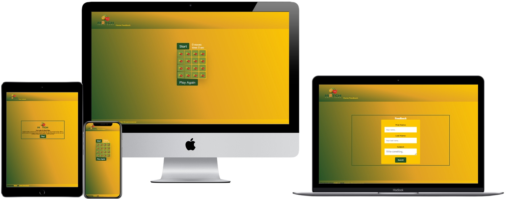
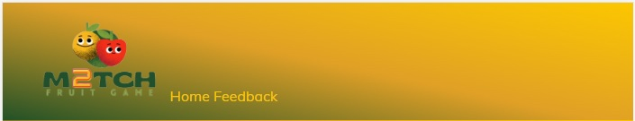
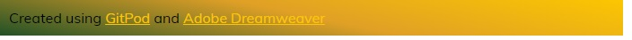
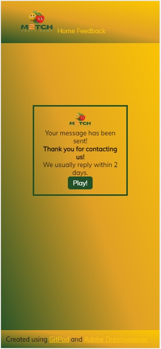
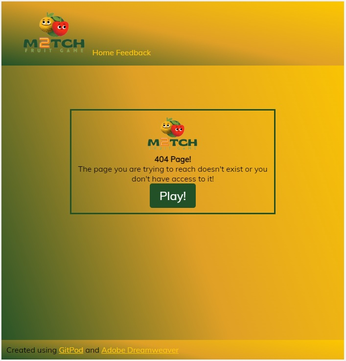
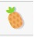

# Match 2 Fruit Game

Match 2 Fruit is a memory game where you match two fruits. You flip the first card and try to find its match by choosing a second card. Once you match two fruits, continue to flip each card and match fruit types until the board is complete. The score has two elements, time and moves.

View the live site: *[here](https://mickymacirl.github.io/CI-P2-Fruit/)*

## Features of Website

## Header

* The website has a fixed header with the Match 2 Logo aligned left and it is responsive on all device sizes.
* This will be displayed throughout the website.

## NavBar

* The navigation links to the Home and the Feedback page and it is responsive on all device sizes.
* Users will be able to navigate between each page of the site, having consistent menu placement on the different screen sizes.

## Footer

* The website has a fixed footer which describes what programs the site was designed in, with a link to each that opens on a new page.
* Users will be able to find additional information about the programs used.

## Index Page

## Game Page

## Feedback Page

## Confirm Page

* The feedback form is using the *[Code Institute Form Dump](https://formdump.codeinstitute.net/)* to validate the form.

* Access the Confirm.html page: *[here](https://mickymacirl.github.io/CI-P2-Fruit/confirm.html)*

## 404 Page

* Access the 404.html page: *[here](https://mickymacirl.github.io/CI-P2-Fruit/404.html)*

## Game Board

* The Main Game Board has a Start button, that disables with a grey color when the board is active, with the number of moves taken so far and the time since either clicking on the start button or turning the first card, both displayed above the random grid of Cards.

* The Main Game Board (game.html) is a 4x4 set of cards which can be turned with a mouse click, clicking a second card to try to find the fruit match. If unsuccessful, both unmatched turned cards revert to being unturned.

* The board is built using the *[Grid Template Columns](https://developer.mozilla.org/en-US/docs/Web/CSS/grid-template-columns)* CSS property.

* The Main Game Board has a Play Again button which links back to Index.html.

## Features to be Added

* A user tracking system.
* A scoreboard of past visits.
* An option to choose a certain size of the main game board.

## Design Choices

## Fruit Emoji

* The following Emoji were used to randomly fill the main game board using the generateGame function:

| EMOJI       | Unicode Hex | HTML Dec Value |Image           |
|-------------|-------------|----------------|----------------|
| Grapes      | U+1F347     | &#127815       ||
| Banana      | U+1F34C     | &#127820       ||
| Strawberry  | U+1F353     | &#127827       ||
| Green Apple | U+1F34F     | &#127823       ||
| Pineapple   | U+1F34D     | &#127821       ||
| Tangerine   | U+1F34A     | &#127818       ||
| Coconut     | U+1F965     | &#129381       ||
| Tomato      | U+1F345     | &#127813       ||
| Mango       | U+1F96D     | &#129389       ||
| Cherries    | U+1F352     | &#127826       ||

## Back of Card Image

* From the Site Logo, created a back of the card image to display the card front before a card is flipped.

## Colors

* The website, logo and text effects use the following colors which go together well.

* Forest Green Traditional, Marigold and Golden Poppy.

## Fonts

* The below fonts look well together on the page, and suit the look and feel of the website.

* Used the font *[Muli from Adobe Fonts](https://fonts.adobe.com/fonts/muli)* for the main text of the website and buttons.

* Muli is no longer listed under Google Fonts but can still be imported for use with a website, explanation found *[here](https://www.reddit.com/r/fonts/comments/i1b44r/did_google_remove_muli_font_from_its_collection/here)*.

## Logo

* The logo was designed to fit the theme of a fruit matching game.

* Used the *[Gliker Semi Bold](https://www.whatfontis.com/NMY_Gliker-Semi-Bold.font)* and *[HK Modular](https://www.fontpath.com/?layout=grid&color=white&adjust=capital&sort=popular&size=100&spacing=0&name=&cat=170&text=&expand=T11882&page=2)* available for use on the *[Canva](https://www.canva.com/)* platform for the logo design.

## Favicon

* The Favicon was designed from the back of the card image, the image used when using *[Favicon & App Icon Generator](https://www.favicon-generator.org/)* was:

## Wireframes

### Landing Page Wireframe

### Game Page Wireframe

### Feedback Page Wireframe

### Confirm Page Wireframe

### 404 Page Wireframe

## User Goals

* Visually attractive game website.
* It is easy to navigate the website.
* Can see my moves and time easily.

## User Stories

* As a user, I want instructions on how to play the game.
* As a user, I want to enjoy the game.
* As a user, I want to view how many moves I’ve made and the time it’s taken.
* As a user, I want the option to play the game again after one game ends.

## Site Owner Goals

* To create a website that is easy to navigate.
* To create an appealing website that a user will want to visit.

## Technology

## HTML

* The structure of this website is using *[HTML](https://en.wikipedia.org/wiki/HTML)*.

## CSS

* The website was styled by connecting a custom *[CSS](https://en.wikipedia.org/wiki/CSS)* to an external file.

## Javascript

* This website's game board uses *[Javascript](https://en.wikipedia.org/wiki/JavaScript)* to an external file.

## Visual Studio Code

* The website was developed using *[Visual Studio](https://visualstudio.microsoft.com/)* Code IDE.

## GitHub

* Source code is hosted on *[GitHub](https://github.com/)* and deployed using *[GitPages](https://pages.github.com/)*.

## Adobe Photoshop

* Used *[Adobe Photoshop](https://www.adobe.com/products/photoshop.html)* for overall design and logo images.

## Adobe Dreamweaver

* The website was tested and designed using *[Adobe Dreamweaver](https://www.adobe.com/products/dreamweaver.html)*.

## Google Fonts

* This website uses *[Google Fonts](https://fonts.google.com/)*.

## balsamiq

* Created wireframes for this website using *[balsamiq](https://balsamiq.com/wireframes/desktop/#/)*.

## Testing

* Link to Testing ReadMe can be found at the *[Testing ReadMe](/TESTING.md)* link.

## Deployment

## Template

* A repository called 'CI-P2-Fruit' was created using the *[Code Institute GitPod Full Template](https://github.com/Code-Institute-Org/gitpod-full-template)*.

## Version Control

Both *[Visual Studio](https://visualstudio.microsoft.com/)* code editor and *[GitPod](https://gitpod.io/workspaces)* were used to create this site and then pushed to the GitHub remote repository named ‘*[CI-P2-Fruit](https://github.com/mickymacirl/CI-P2-Fruit)*’.

The following commands were used to push code to the remote repository:

1. *git add .* was used to stage all files for commit changes.

2. *git commit -m “commit message”* was used to add the changes to the local repository for upload during a push.

3. *git push* was used to push all local changes to the remote repository on GitHub.

## Deployment to GitHub Pages

The site was deployed to GitHub Pages.

Below are the steps required:

1. In **GitHub**, navigate to your username.github.io repository and click Settings.
2. Within Settings, navigate to the Source section within the **GitHub Pages** section. From the dropdown menu, select master branch and then click Save.

## Deploying New Changes

Once **GitHub Pages** is set up, normal **GithHub** flow updates the live page.

View the live site: *[here](https://mickymacirl.github.io/CI-P2-Fruit/)*

## Forking Forking the Repository

Forking creates a copy of the repository to view and/or make changes without affecting the original.

Below are the steps required:

1. In GitHub, access the specific GitHub Repository - *[Match 2 Fruit Game](https://github.com/mickymacirl/CI-P2-Fruit)*
2. Towards the top right of the repository page, underneath the user icon you will find and click the "Fork" Button.
3. You will have successfully created a copy of the original repository within the logged-in GitHub account.

## Clone the 'CI-P2 Fruit Game' GitHub Code Repository locally

1. Go to the page of the repository that you want to clone, the **CI-P2 GitHub** site: *[here](https://mickymacirl.github.io/CI-P2-Fruit/)*
2. Click on the **“Code”** menu and copy the URL.
3. Use the git clone command along with the copied URL.
4. git clone <https://github.com/USERNAME/REPOSITORY>

## Credits

## Mentor Support

* Mentor support from *[Daisy McGirr](https://github.com/Daisy-McG)*.

## Markdown Language

* Used syntax from *[Markdown Guide](https://www.markdownguide.org/basic-syntax/)* for reference.

## Markdown Table Generator

* Used TableGenerator.com *[Table Generator](https://www.tablesgenerator.com/markdown_tables)* to build Emoji Readme Table.

## Meta Tags

* Used SEO Timers *[Meta Tag Generator](https://www.seoptimer.com/meta-tag-generator)* to generate html meta-tags.

## W3 Schools Media Queries

* Used W3 Schools *[CSS Media Queries - More Examples](https://www.w3schools.com/Css/css3_mediaqueries_ex.asp)* to code media queries.

## Sticky Header and Footer

* Sticky Header and Footer from *[Tutorial Republic](https://www.tutorialrepublic.com/faq/how-to-create-fixed-header-or-footer-using-css.php)*.

## WebTips.Dev Memory Game

* WebTips.Dev Memory Game from *[WebTips.Dev](https://www.webtips.dev/memory-game-in-javascript)*.

## Grid Template Columns

* Used *[Grid Template Columns](https://developer.mozilla.org/en-US/docs/Web/CSS/grid-template-columns)* for reference for the main game board.

* Used *[W3 School Grid Template Columns](https://www.w3schools.com/CSSref/pr_grid-template-columns.asp)* for reference and troubleshooting the main game board.

## Fruit Emojis

* Fruit Eomijis from *[AltCodes.net](https://www.alt-codes.net/food-emoji)*.

## Code Institute Form Dump

* Used *[Code Institute Form Dump](https://formdump.codeinstitute.net/)* to validate contact form.

## Javascript Basics

* Javascript Basics from *[JsChallenger.com](https://www.jschallenger.com/javascript-fundamentals/javascript-basics)*.

## Favicon Generator

* Used *[Favicon & App Icon Generator](https://www.favicon-generator.org/)* to generate the favicon and *[W3 Schools HTML Favicon](https://www.w3schools.com/html/html_favicon.asp)* for the HTML.

## W3 School Responsive Web Design - Images

* Used *[W3 School Responsive Web Design - Images](https://www.w3schools.com/css/css_rwd_images.asp)* to resize logo image.

## Mozilla.org Reference

* Reference from *[Mozilla.org](https://developer.mozilla.org/en-US/docs/Web/JavaScript/Reference)*.

## Adobe Fonts

* Used *[Muli from Adobe Fonts](https://fonts.adobe.com/fonts/muli)* for screenshots for readme.

## Unicorn Revealer

* Used *[Unicorn Revealer](https://chrome.google.com/webstore/detail/unicorn-revealer/lmlkphhdlngaicolpmaakfmhplagoaln?hl=en-GB)* to troubleshoot layout and responsiveness.

## Chrome Dev Tools

* Used *[Chrome Dev tools](https://developers.google.com/web/tools)* to debug code and troubleshoot layout and responsiveness.

## Media Genius

* Used *[Media Genius](<https://responsivedesignchecker.com/>)* responsiveness website to troubleshoot layout and responsiveness.

## markdownlint

* Used *[MarkdownLint](https://open-vsx.org/extension/DavidAnson/vscode-markdownlint)* extension in Visual Studio to troubleshoot markdown errors in readme's.

## GitLens 12

* Used *[GitLens 12](https://open-vsx.org/extension/eamodio/gitlens)* extension in Visual Studio to help over all Git management.

## CSS3 2D Transforms

* Used *[CanIuse?](https://caniuse.com/transforms2d)* to troubleshoot translate / transform in Safari.

## LambDaTest Safari

* Used *[LambDaTest.com](https://www.lambdatest.com/)* to test webkit changes in CSS.

## Grammarly Office Plugin

* Used *[Grammarly Office Plugin](https://www.grammarly.com/office-addin)* on spelling, grammar, punctuation, clarity, and writing style in the ReadMe's.

## Git and GitHub

* Used *[W3C Git Tutorial](https://www.w3schools.com/git/default.asp?remote=github)* for reference.

* Used *[GitHub Git-Guides](https://github.com/git-guides)* for reference.

## GitPod

* Used *[GitPod Help Page](https://www.gitpod.io/support)* for reference.

## Multi-Device Website Mockup Generator

* Used *[Am I Responsive](https://ui.dev/amiresponsive)* to create a mutli-device mockup.

## Version Control Reference

* Used Our Coding Club *[GitHub.io](https://ourcodingclub.github.io/tutorials/git/)* How To's for reference.

## Content

* Logo created using *[Canva](https://www.canva.com/)* and *[Adobe Photoshop](https://www.adobe.com/products/photoshop.html)*.
