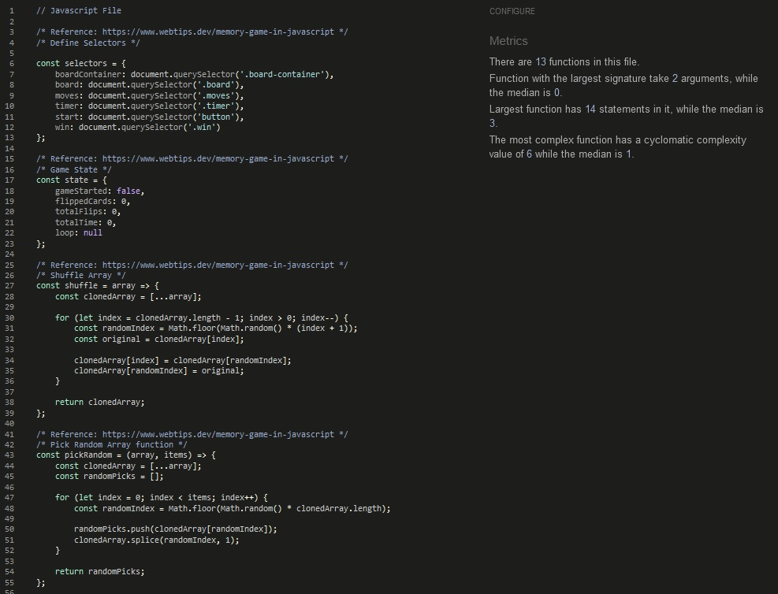

# Testing

* Link to ReadMe can be found at the *[ReadMe](/README.md)* link.

## Accessibility

## Lighthouse Testing

### Desktop Testing

Desktop Lighthouse testing is showing a perfect score of 100 across the board.

### Mobile Testing

Mobile Lighthouse Testing is showing a score of 95, with SEO having a score of 92.

## Functional Testing

## Navigation Links Testing

Testing was done to make sure all navigation links led to the intended pages on their respective pages.

The navigation links on the navbar on each page were used to do this and were successful.

## Footer Link Validation

The footer was tested so that when a user clicks on the link for GitPod and Adobe Dreamweaver, the page should open in a new browser window.

**Test Steps:**

    1. Open the corresponding browser and open the Match 2 Fruit Game website.
    2. Click on the Gitpod and Adobe Dreamweaver links in the footer of the page.

**Expected:**

The link should open in a new window, to each of the websites.

**Actual:**

The link opened in a new window, to each of the websites.

## Form Testing

## Form Submit

The Feedback form was tested so that when a user clicks on submit, the act directs to the confirm.html web page with a success message.

**Test Steps:**

    1. Open the corresponding browser and open the Match 2 Fruit Game website.
    2. Navigate to the Feedback page using the Feedback link.
    3. Enter details in the First Name, Last Name, and Subject fields.
    4. Click the Submit button.

**Expected:**

The user should be redirected to the confirm.html page with the success message being displayed.

**Actual:**

The website redirected the user to the confirm.html page with the success message being displayed.

## Form Validation

The Feedback form was tested so that when a user tries to submit a blank form, the form should fail to submit with a "Please fill out this field" message.

**Test Steps:**

    1. Open the corresponding browser and open the Match 2 Fruit Game website.
    2. Navigate to the Feedback page using the Feedback link.
    3. Click the Submit button.

**Expected:**

The form should display the message "Please fill out this field".

**Actual:**

The form displayed the message "Please fill out this field".

## Favicon Validation

The Favicon was tested so that when a user loads a page, the favicon should display in the top bar of the browser window.

**Test Steps:**

    1. Open the corresponding browser and open the Match 2 Fruit Game website.
    2. Confirm visually that the favicon is in place by checking the top bar of the browser.

**Expected:**

The web browser should display the favicon for the page.

**Actual:**

The web browser displayed the favicon for the page.

## Game Function Validation

### Random Fruit Placement in the Main Game board

The game board was tested to ensure that the 10 different Fruit Emoji are randomly placed while being generated.

**Test Steps:**

    1. Open the corresponding browser and open the Match 2 Fruit Game website.
    2. Navigate to the Game page and open the Dev Tools of the corresponding browser.
    3. Select the first card-front div generated cell, and hide the css styling.
    4. Select the first card-back div generated cell, and hide the css styling.
    5. Expand all div card, div card-front and card-back cells and check for randomness.
    6. Reload the page and carry out steps 2 to 5 repeating 5 times to check for randomness.

**Expected:**

The game board cells and emoji placements should be random so as not to have repeating or bunched together emoji.

**Actual:**

The game board cells and emoji placement is random, has no repeating or bunched together emoji.

#### Board Random Testing 1

#### Board Random Testing 2

#### Board Random Testing 3

#### Board Random Testing 4

#### Board Random Testing 5

### Fruit Match True

The game cards should stay turned when a fruit match is successful.

**Test Steps:**

    1. Open the corresponding browser and open the Match 2 Fruit Game website.
    2. Navigate to the Game page and choose a card.
    3. Continue the game until a match is made.

**Expected:**

The two matched fruit cards should stay flipped.

**Actual:**

The two matched fruit card stayed flipped.

### Fruit Match False

The game cards should flip back when a fruit match is unsuccessful.

**Test Steps:**

    1. Open the corresponding browser and open the Match 2 Fruit Game website.
    2. Navigate to the Game page and choose a card.
    3. Choose a card that does not match the already turned card.

**Expected:**

The two unmatched fruit cards should flip back to unflipped.

**Actual:**

The two unmatched fruit cards fliped back to unflipped.

### Win Message

The Win Message was tested so that when a user finishes the game successfully by matching all fruit pairs, the game area should transform to a win screen with the total flips and total time its taken.

**Test Steps:**

    1. Open the corresponding browser and open the Match 2 Fruit Game website.
    2. Navigate to the Game page and match all fruit pairs to win the game.
    3. Click the Submit button.

**Expected:**

The game page should display You have won with the total flips of 41 moves and a total time of 53 seconds.

**Actual:**

The game page displayed You have won with a total flips of 41 moves and a total time of 53 seconds.

## Validator Testing

### Javascript Validator Testing

* Used Jshint to test Javacript, results are showing no errors. To achieve no issues the validator needs to be configured to allow ES6 through the configuration options or by adding the comment, "/*jshint esversion: 6*/" at the top of the Javascript paste/file.

## HTML Validator Testing

* Used *[W3 HTML Validator](https://jigsaw.w3.org/css-validator/)* to validate HTML, results are showing no errors.

## CSS Validator Testing

* Used *[W3 CSS Validator](https://jigsaw.w3.org/css-validator/)* to validate CSS, results are showing no errors.

